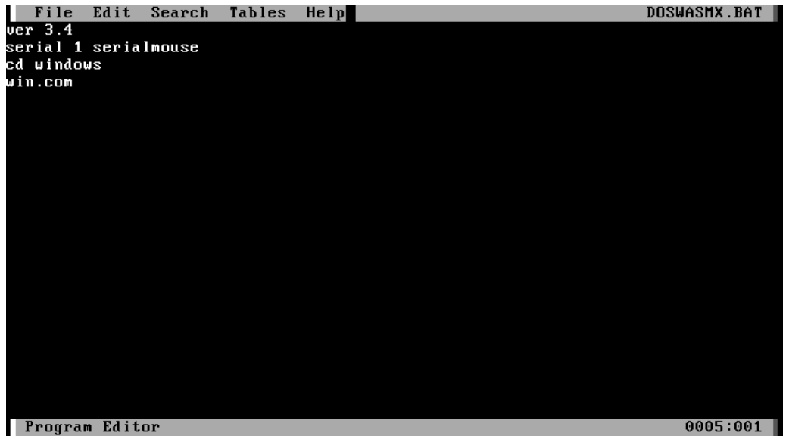
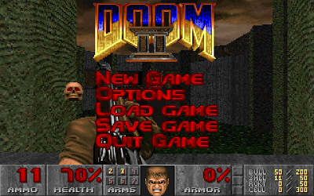
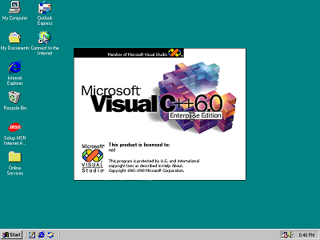
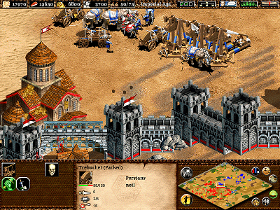
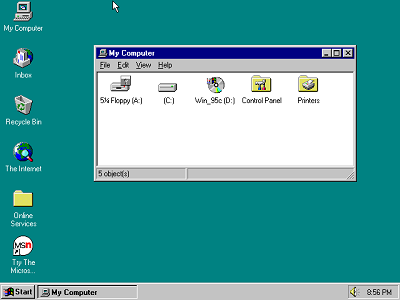
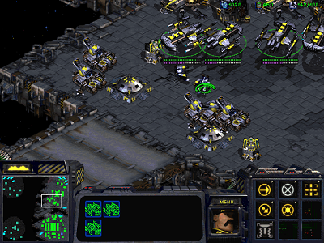
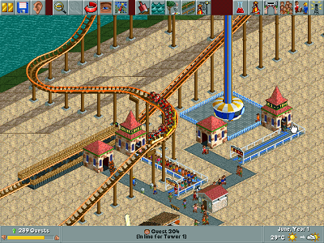
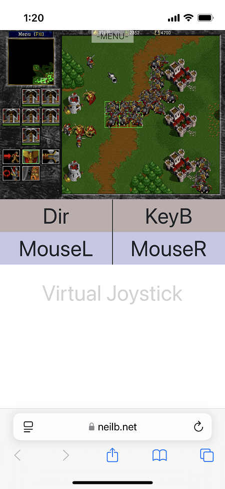
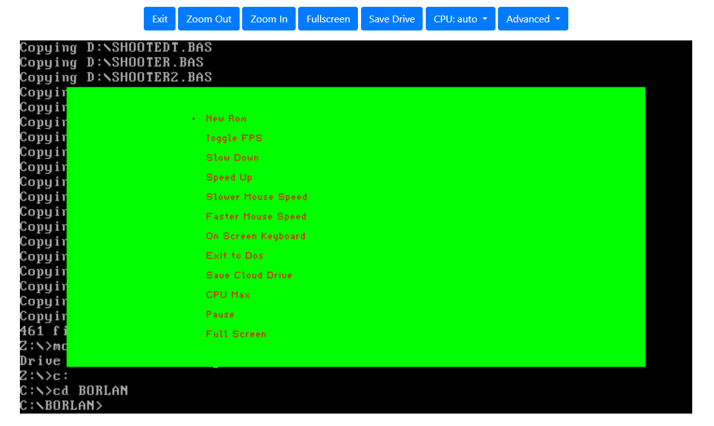
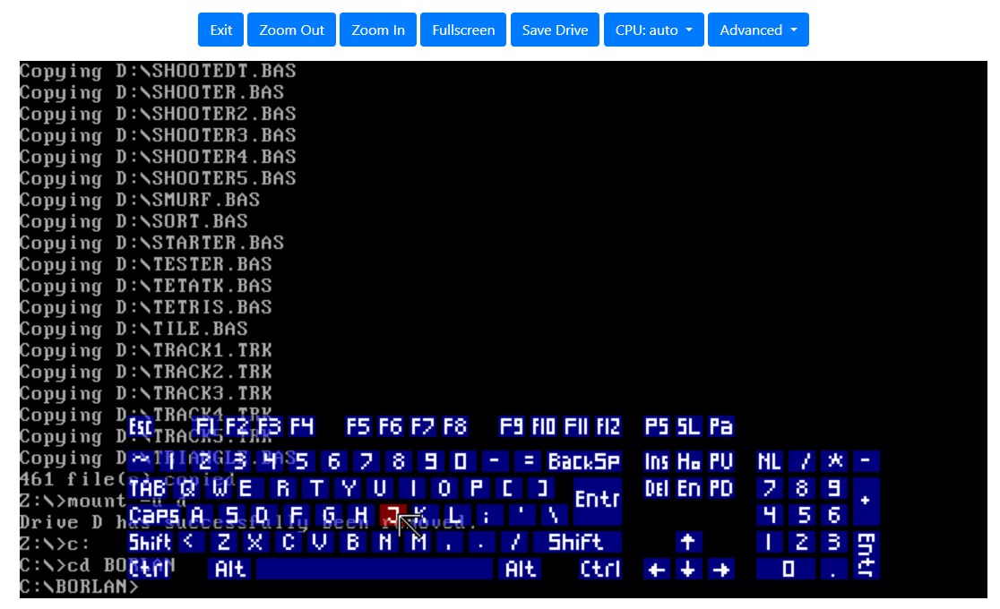

# DOS Wasm X
This is a browser based DOS emulator designed around ease of use and stability. It is based on the newer DosBox-X codebase and thus supports both Windows 95 and Windows 98 installations. However if you just want to use DOS applications and games you can stay in DOS mode. To begin using it simply drag and drop any application or game files onto the emulator. You can then save your hard disk with the click of a button or just exit if you want to discard your changes. I went with a simple and clean interface to try and make it approachable and non-intimidating. The hard disk saves directly in your browser so you can come back later and continue where you left off. It's like your own personal virtual machine on the web!

Supports the following features -
- Fully web based application - using web assembly
- Save hard drive to the browser (512mb, 1 gig, or 2 gig options)
- Automatic support for a variety of file formats (Iso, Zip, Bin, Cue, Img, 7z)
- Customize RAM (32mb, 64mb, 128mb)
- Import/export files into and out of the emulator
- Export your entire hard disk image for local saving
- Load/change CD while emulator is running
- Floppy Disk Support
- Speed up/slow down emulator time
- Mobile mode
- On scren keyboard
- Gamepad support
- Customize Mouse Sensitivity
- Dark Mode
- Audio support
- Full screen
- Zoom controls
- Mouse capture
- Resize resolution
- Customize CPU speed
- Host the application yourself
- Customize startup hard drive image
- Send CTRL/ALT/DELETE
- Pause/Unpause
- Import existing IMG hard disk if you already have one

You can try it here: https://www.neilb.net/doswasmx/


# Hosting
You can host the app on your own web server. Copy everything in the `dist\` folder to your web server.

Also you can optionally configure a Default Hard Drive to load when users navigate to your application. After Saving/Configuring a Hard Drive locally you can export it from the advanced menu.


Then update the settings.js file with the path to your img file

```javascript

var DOSWASMSETTINGS = {
    CLOUDSAVEURL: "",
    ISOURL: "",
    DEFAULTIMG: "https://www.yourwebsite.com/hdd.img"
}

```

# Startup Script
You can automate a startup script by creating a "DOSWASMX.BAT" file. It needs to live in the root C:\ drive, not in any subfolder. At the root type "EDIT DOSWASMX.BAT" to create the file and put each command on a seperate line. Then save your file and the hard drive. Example -




# Build Instructions
You will need a Linux environment to build DOS Wasm X

- create a folder outside of this repo to install emscripten
- git clone https://github.com/emscripten-core/emsdk.git
- cd emsdk
- ./emsdk install 3.1.49
- ./emsdk activate 3.1.49
- source ./emsdk_env.sh
- replace Binaryen with special version
  - replace the file wasm-opt in `emsdk/upstream/bin/wasm-opt` with the one from this repo `code/wasm-opt`
  - navigate to the `emsdk/upstream/bin/` folder and run `chmod +x wasm-opt`
  - this is needed because default Binaryen does not support Exceptions and Asyncify together
  - huge credit goes to @Caiiiycuk for developing this! 
  - see references below if you prefer to get wasm-opt directly from his releases page
- navigate back to the code folder in the DosWasmX repo
- run `make`
  - you will get a build error towards the end saying EM_CACHE_IS_LOCKED
  - to get past this error simply copy the faulting emcc command from the terminal and run it manually (See screenshot below)
  - this should succeed and then run `make` again to finish building
  - later builds should not get this error after you do this one time fix
- this process will update the main.js and main.wasm files in your dist folder
- now serve the dist folder from a webserver and Enjoy!

The emscripten installation above is a one time setup however you will need to always run `source ./emsdk_env.sh` from the emscripten folder every time you close the terminal and before running `make`. This is because the emscripten compiler does not get saved to the PATH


# Docker

If you wish to run directly in a container, you can use the following command after installing Docker Desktop:

```bash
docker run -d -p 80:80 nbarkhina/doswasmx
```

Once it has started, you can open your browser to [http://localhost](http://localhost).

# Online Documentation

For more extensive guides and technical information please refer to our [Online Documentation](https://nbarkhina.github.io/DosWasmX/)

# Screenshots


















# Mobile Mode



# Overlay

- There is also a built in Overlay menu which can be accessed by pressing the tilde key on the keyboard "~"
- This can be useful for getting at certain functions when using a Gamepad Controller or to access the onscreen keyboard





# Installing Windows
DOS Wasm X supports installing Windows 95 or Windows 98 using your own copy of Windows. Simply drag and drop the ISO onto the startup page. DOS Wasm X will detect the Windows CD and begin the installation process. If you choose to Install Windows 95 you may get the error below. Simply click OK and then cancel when it asks you for the Path to the CD. This will allow you to continue with the installation. The reason for this error is because at this stage of the process the CD drivers have not yet been loaded. However after restarting Windows it will detect the CD Drive and finish installing the drivers successfuly. Always remember to shut down windows in the guest OS before exiting the page. This will automatically save your hard drive changes to the browser and prevent scandisk from running the next time you boot into Windows.


# Common DOS Commands
- DIR - Display list of files and directories
- CD - Change the current directory
- XCOPY - Copy Files
- DEL - Delete one or more files
- MKDIR - Create a directory

You can also type HELP at the command line to get a list of commands.

# References
The Following codebases were used in some part in creating this app

- DOSBox-X (Core Engine)
  - https://github.com/joncampbell123/dosbox-x 
- DOSBox Pure (Onscreen Keyboard)
  - https://github.com/schellingb/dosbox-pure
- JS Dos (JSDos Asyncify Module)
  - https://github.com/caiiiycuk/js-dos 
- Binaryen with Exceptions and Asyncify 
  - https://github.com/caiiiycuk/binaryen-fwasm-exceptions
- Emscripten 
  - https://github.com/emscripten-core/emscripten

# Disclaimer
This app was made for fun and is not affiliated or associated with Microsoft.
