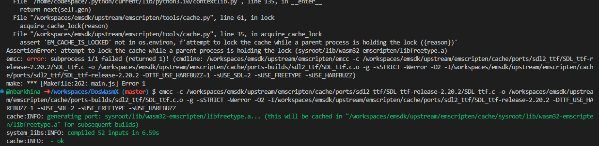
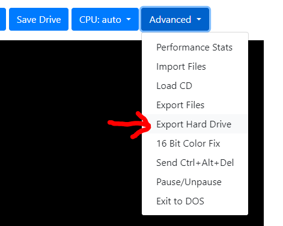
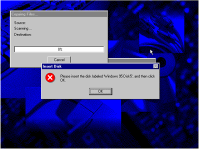

# DOS Wasm X
intro

Supports the following features -
- TBD

You can try it here: https://www.neilb.net/doswasmx/

# Build Instructions
You will need a Linux environment to build DOS Wasm X

- create a folder outside of this repo to install emscripten
- git clone https://github.com/emscripten-core/emsdk.git
- cd emsdk
- ./emsdk install 3.1.49
- ./emsdk activate 3.1.49
- source ./emsdk_env.sh
- replace Binaryen with special version
  - replace the file wasm-opt in `emsdk/upstream/bin/wasm-opt` with the one from this repo `code/wasm-opt`
  - navigate to the `emsdk/upstream/bin/` folder and run `chmod +x wasm-opt`
  - this is needed because default Binaryen does not support Exceptions and Asyncify together
  - huge credit goes to @Caiiiycuk for developing this! 
  - see references below if you prefer to get wasm-opt directly from his releases page
- navigate back to the code folder in the DosWasmX repo
- run `make`
- you will get a build error towards the end saying EM_CACHE_IS_LOCKED
  - to get past this error simply copy the faulting emcc command from the terminal and run it manually (See screenshot below)
  - this should succeed and then run `make` again to finish building
  - later builds should not get this error after you do this one time fix
- then copy these 2 files from the code\ folder into the dist\ folder
  - main.js
  - main.wasm

The emscripten instructions above are a one time setup however you will need to always run `source ./emsdk_env.sh` every time you close the terminal. This is because the emscripten compiler does not get saved to the PATH



# Hosting
You can host the app on your own web server. Copy everything in the `dist\` folder to your web server.

Also you can optionally configure a Default Hard Drive to load when users navigate to your application. After Saving/Configuring a Hard Drive locally you can export it from the advanced menu.



Then update the settings.js file with the path to your img file

```javascript

var DOSWASMSETTINGS = {
    CLOUDSAVEURL: "",
    ISOURL: "",
    DEFAULTIMG: "https://www.yourwebsite.com/hdd.img"
}

```

# Installing Windows
DOS Wasm X supports installing Windows 95 or Windows 98 using your own copy of Windows. Simply drag and drop the ISO onto the startup page. DOS Wasm X will detect the Windows CD and begin the installation process. If you choose to Install Windows 95 you may get the error below. Simply click OK and then cancel when it asks you for the Path to the CD. This will allow you to continue with the installation. The reason for this error is because at this stage of the process the CD drivers have not yet been loaded. However after restarting Windows it will detect the CD Drive and finish installing the drivers successfuly. 



# Common DOS Commands
TBD

# Screenshots
TBD

# References
- DOSBox-X https://github.com/joncampbell123/dosbox-x
- Binaryen with Exceptions and Asyncify https://github.com/caiiiycuk/binaryen-fwasm-exceptions
- Emscripten https://github.com/emscripten-core/emscripten

# Disclaimer
This app was made for fun and is not is not affiliated or associated with Microsoft.